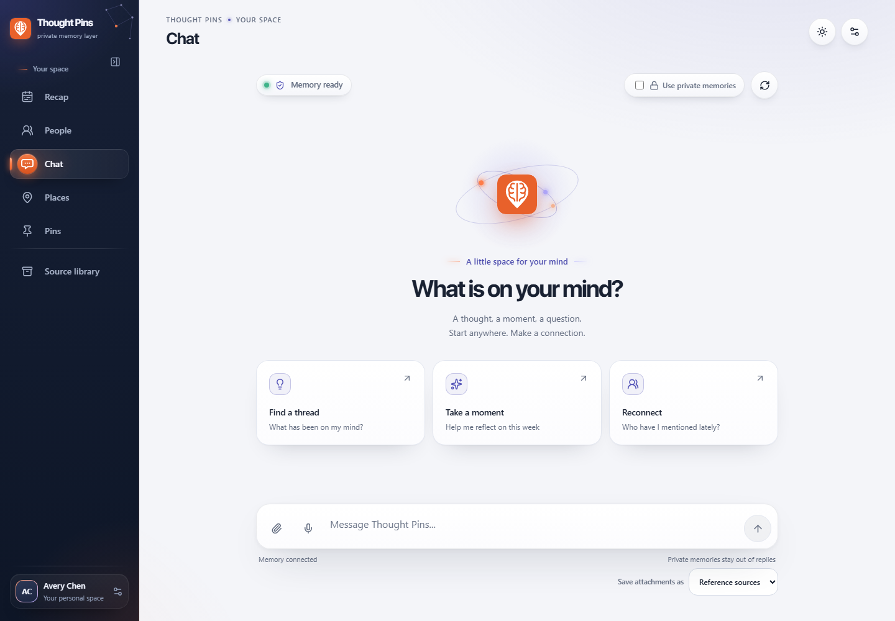
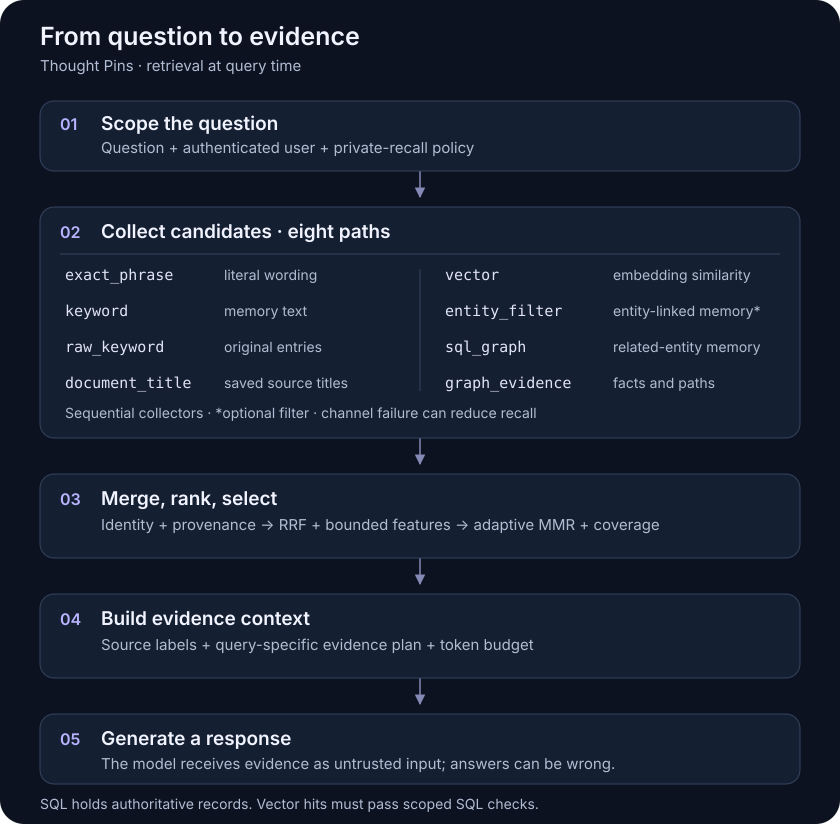

<div align="center">



Inspired by [David Rockefeller's card file](https://www.wsj.com/articles/david-rockefellers-famous-rolodex-is-astonishing-heres-a-first-peek-1512494592): remember the people you meet and the moments you share. Thought Pins brings that habit into a searchable personal record, with memories linked to their sources and exports you can keep.

[](https://github.com/seramasamy/thoughtpins/actions/workflows/ci.yml)
[](LICENSE)
[](.python-version)
[](mobile/ios/ThoughtPinsNative/README.md)

**Open-source journaling with structured recall and portable exports.**

[Website](https://thoughtpins.com/#product) · [Run locally](#run-locally) · [Codebase walkthrough](docs/architecture/TECHNICAL_REVIEW_GUIDE.md) · [Documentation](docs/README.md)

</div>

## A personal record you can return to

Thought Pins turns journal notes, conversations, voice notes, and saved reading
into a connected record of people, places, events, and ideas. Ask about a past
moment, inspect its source, or export your own record as plain files.

The product includes a responsive React web app, a native SwiftUI iPhone/iPad
app, a FastAPI backend, and an Obsidian-compatible vault. Five destinations —
**Recap, People, Chat, Places, and Pins** — keep the experience consistent across
screens. Android has a separate client and build checks.



*Product capture uses a fictional account. [Mobile and desktop previews](https://thoughtpins.com/#product).*

The project is in active development. Source, automated checks, and setup
instructions are public; hosted availability and store distribution are
separate release decisions. See [validation and limits](#validation-and-limits)
for what the evidence supports.

## Alternatives, briefly

Thought Pins groups journal capture, people and place views, source retrieval,
and export in one application. The tools below overlap with different parts of
that workflow.

| Alternative and focus | When Thought Pins helps |
| --- | --- |
| [ChatGPT](https://learn.chatgpt.com/docs/customization/memories) / [Claude](https://support.claude.com/en/articles/11817273-use-claude-s-chat-search-and-memory-to-build-on-previous-context): general assistants with memory | A dedicated journal, people/place views, and an inspectable memory pipeline. |
| [Claudian](https://github.com/YishenTu/claudian) / [Copilot for Obsidian](https://www.obsidiancopilot.com/en): agents and search inside your vault | Capture into a structured personal record; keep Obsidian as a portable export. |
| [Gemini Notebook, formerly NotebookLM](https://workspace.google.com/products/gemini-notebook/): research grounded in sources | Connect saved reading with your own experiences and relationships. |
| [Mem](https://help.mem.ai/features/search), [Reflect](https://reflect.app/), [Tana Outliner](https://outliner.tana.inc/): connected notes and AI workflows | A predefined journal-to-memory workflow, with self-hostable source code. |
| [Khoj](https://docs.khoj.dev/): open-source personal AI over files and the web | An experience organized around Recap, People, Chat, Places, and Pins. |
| [Mem0](https://github.com/mem0ai/mem0) / [Zep](https://help.getzep.com/concepts): memory infrastructure for developers | A user-facing app with capture, consent, export, and deletion already wired together. |
| [Hermes Agent](https://hermes-agent.nousresearch.com/docs/user-guide/features/memory/) / [OpenClaw](https://docs.openclaw.ai/concepts/memory): agents with persistent memory and tools | A focused personal archive with explicit source and account lifecycle controls. |

These tools overlap: memory, graphs, citations, privacy controls, and exports
are not unique to Thought Pins. This is a workflow comparison, not a quality
ranking. [Comparison sources and scope](docs/architecture/ALTERNATIVES.md)
were checked against first-party documentation on 11 September 2026.

## How recall works

The central problem is preserving a useful personal record while extraction,
retrieval, model responses, and network delivery can all be imperfect. Thought
Pins keeps durable source records separate from derived memory and gives each
stage an inspectable contract.

| Mechanism | Implementation and purpose |
| --- | --- |
| **Typed extraction and provenance** | Bounded ontology, entity resolution, attributed claims, temporal validity and supersession preserve the relationship between a memory and its source. [Ingestion](src/thoughtpins/ingestion/service.py) · [Schema](src/thoughtpins/db.py) |
| **Hybrid candidate generation** | Eight retrieval paths combine exact phrases, lexical matches, embeddings, entity/graph evidence and source titles. An unavailable channel can degrade recall without aborting all search. [Search](src/thoughtpins/memory/search.py) |
| **Replayable ranking** | Reciprocal rank fusion, bounded relevance/salience signals, social attribution penalties, and adaptive diversity/coverage selection. The ranking policy exposes 20 validated parameters and explicit ablation switches. [Ranker](src/thoughtpins/memory/ranking.py) |
| **Evidence-aware context** | Query-specific evidence planning, source labels and token budgeting retain attribution and mark retrieved text as untrusted input. [Evidence plan](src/thoughtpins/memory/evidence_plan.py) · [Context](src/thoughtpins/memory/context_package.py) |
| **Durable asynchronous work** | Relational job claims, broker handoff recovery and deduplicated persistence address interrupted and repeated delivery. [Job delivery](docs/architecture/TECHNICAL_REVIEW_GUIDE.md#job-delivery) |
| **Tenant and lifecycle boundaries** | User-scoped storage, PostgreSQL RLS, private-recall controls, token rotation, export and coordinated deletion across derived indexes. [RLS verification](scripts/verify_postgres_rls.py) · [Lifecycle](src/thoughtpins/data_lifecycle.py) |

### Eight-channel retrieval, from question to evidence

On capture, original sources and extracted entities, relationships and memories
are persisted in SQL; vector and graph projections provide additional access
paths. SQL holds the authoritative records, and supported derived indexes can
be rebuilt. At query time, the following stages assemble evidence for a reply.



Scope → collect → merge/rank/select → build context → respond. The diagram is
a static SVG, with the channel and ranking contracts described in the text below.

The channel groups show complementary mechanisms, not parallel execution or
independent votes. The current collectors run sequentially; `entity_filter`
runs only when supplied. Each collector has an exception boundary, and losing
a channel can reduce recall. Vector hits are checked against scoped SQL
records before admission. The lexical channels use the project's token/phrase
scoring; BM25 is a separate evaluation baseline.

A rare name can survive literal lookup when its
embedding match is weak. A paraphrase can benefit from vectors. Graph expansion
can reach related memories, while raw-entry lookup can recover wording that
extraction omitted. These are design motivations; channel ablations determine
their measured contribution on a given workload.

Duplicate candidate identities retain
the channels that found them and their ranks. Reciprocal rank fusion contributes
`RRF(d) = Σc 1 / (60 + max(1, rank_c(d)))`; the final score also uses bounded
lexical, temporal, salience and social-attribution features. The 20 validated
ranking parameters define a heuristic policy, not a learned reranker or a
probability of correctness. Adaptive maximal marginal relevance (MMR) reduces
redundancy, and coverage checks retain evidence for the question's different
aspects. The evidence plan and context budget then prepare labelled material
for the response model.

Candidate generation, fixed-pool ranking and live-model answers are separate
evaluation targets. Ranking experiments replay a cloned candidate pool with a pinned
`as_of_date` under policy ablations and measure source-level Recall@k, MRR/nDCG
and evidence coverage. The
[search recovery tests](tests/test_search_resilience.py),
[recall tests](tests/test_search_recall.py) and
[ranking regressions](tests/test_retrieval_robustness.py) cover concrete failure
cases. Larger holdouts, dense/learned baselines and production latency/cost
measurements remain the next evidence to establish.

The [algorithm walkthrough](docs/architecture/RETRIEVAL_ARCHITECTURE.md) links
the equations to their implementation. The
[evaluation protocol](docs/architecture/EXTERNAL_MEMORY_BENCHMARKS.md) records
datasets, reproduction commands and experimental limits. The
[codebase walkthrough](docs/architecture/TECHNICAL_REVIEW_GUIDE.md) covers the
remaining application boundaries. These references are optional; the app can
be used without reading the implementation.

## User control is part of the design

- **Keep the source.** Extracted memories retain provenance. Editing a chat
  turn does not silently delete journal entries it previously created.
- **Choose private recall.** Already-private memories are excluded by default;
  including them requires the applicable account/request choice and server
  policy. Private text encryption uses the deployment's configured key.
- **Take your record with you.** Account JSON and an Obsidian-compatible vault
  provide portable exports. Third-party source text follows the export policy.
- **Delete through the product.** Account deletion coordinates relational,
  vector and retained-audio cleanup; it reports failure when required cleanup
  cannot be confirmed.
- **Keep external content in its place.** Journals and documents enter model
  context as evidence. These defenses reduce exposure to instruction injection;
  they do not guarantee a model will never follow malicious content.

[Security policy](SECURITY.md) · [Privacy](https://thoughtpins.com/privacy) · [Vault contract](docs/architecture/OBSIDIAN_INTEROPERABILITY.md)

## Run locally

Use the pinned Python 3.13 environment and Node.js 22 for the web build.
Python compatibility is declared in [pyproject.toml](pyproject.toml); release
installs resolve through [uv.lock](uv.lock).

```bash
git clone https://github.com/seramasamy/thoughtpins.git
cd thoughtpins
python -m venv .venv
. .venv/bin/activate
pip install -e ".[dev]"
cp .env.example .env
cd frontend
npm ci
npm run build
cd ..
python -m thoughtpins.server --api-only
```

Open **http://127.0.0.1:8420/app/**. Default local mode uses SQLite; model-backed
extraction and answers require a configured provider. Do not expose local
no-auth mode to the public internet. Configure the provider using the template's
`LLM_PROVIDER`, `LLM_BASE_URL`, `LLM_MODEL`, and `LLM_API_KEY` settings.

[Windows and full setup](docs/operations/RUNNING.md) · [macOS/iOS setup](apple-submission/MAC_START_HERE.md) · [Production operations](docs/operations/PRODUCTION_RUNBOOK.md)

<a id="whats-unproven"></a>

## Validation and limits

CI runs Python, PostgreSQL, web, Android and container checks. Changes affecting
iOS on `main` also trigger native compilation/archive checks; the workflow and
its individual job results are the source of truth for each commit. The local
strict release command is:

```bash
python scripts/release_check.py --strict-quality
```

[Browser tests](frontend/e2e/) cover authentication, navigation, recovery,
privacy, offline behavior and device layouts. [Website tests](frontend/site-e2e/)
cover previews, keyboard control, appearance and accessibility. [Native UI tests](mobile/ios/ThoughtPinsUIReview/README.md)
exercise the production SwiftUI package against fictional fixtures. Passing
these checks does not replace a signed distribution build or real-device review.

The [documented July 2026 evaluation](docs/architecture/EXTERNAL_MEMORY_BENCHMARKS.md#results)
uses 46 LongMemEval cases: Recall@1 is **0.8696 versus 0.8478** for BM25 on the
same candidate sessions — one additional correct top result. This is a small,
confirmatory reranking experiment, not a full benchmark or an end-to-end answer
accuracy result. Both systems reach 1.0 Recall@5/10 on that sample. The full
500-question run, modern dense/learned baselines, untouched larger holdouts,
and live-model adversarial evaluation remain outstanding.

The repository also includes deterministic regression suites and public-domain
literary evaluations. Generated questions from the same passages test
regressions; they are not independent evidence of generalization. Production
scale, live provider quality, physical-device behavior and signed TestFlight
readiness require their own recorded evidence.

## Navigate the repository

| Area | Start here |
| --- | --- |
| Ownership and architecture | [Module map](ARCHITECTURE_MODULES.md) |
| Backend and memory engine | [src/thoughtpins/](src/thoughtpins/) |
| Web app and public site | [frontend/](frontend/README.md) · [site/](site/README.md) |
| Native apps | [mobile/](mobile/README.md) |
| Algorithms and evaluation | [Retrieval architecture](docs/architecture/RETRIEVAL_ARCHITECTURE.md) · [Evaluation protocol](docs/architecture/EXTERNAL_MEMORY_BENCHMARKS.md) |
| Releases and operations | [Documentation index](docs/README.md) · [Production runbook](docs/operations/PRODUCTION_RUNBOOK.md) |

## Contribute

Read [CONTRIBUTING.md](CONTRIBUTING.md) and the [engineering guide](AGENTS.md)
before changing behavior. Use an issue for reproducible bugs or proposed
improvements. Report security issues through [SECURITY.md](SECURITY.md).

Licensed under [Apache-2.0](LICENSE); see [NOTICE](NOTICE). The software license
does not grant rights to the Thought Pins product names or marks.
