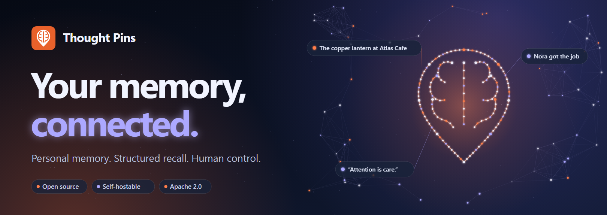
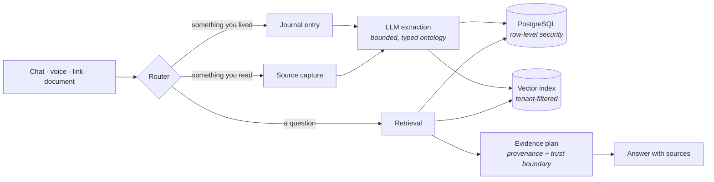

<div align="center">

<!-- A single , deliberately. GitHub rewrites relative URLs in src but not
     inside <source srcset>, so a <picture> with relative paths renders nothing:
     the sources take priority and both fail to resolve. The dark banner is
     self-contained and reads as an intentional band on either GitHub theme. -->


<br>

<!-- The live Actions badge 404s while this repository is private, which renders
     as a broken image. Restore it on the day it is published:
     [](https://github.com/seramasamy/thoughtpins/actions/workflows/ci.yml) -->
[](.github/workflows/ci.yml)
[](LICENSE)
[](.python-version)
[](tests/)
[](CODE_OF_CONDUCT.md)

**A memory layer for real life.** Write naturally, bring in what you read,<br>
and find the right detail months later — without handing your journal to an ad network.

[Website](https://thoughtpins.com) · [Documentation](docs/README.md) · [Architecture](ARCHITECTURE_MODULES.md) · [Security](SECURITY.md)

</div>

---

## Why not just use ChatGPT or Claude memory?

Fair question, and the honest answer is that they solve a different problem. Their memory
exists to make *the assistant* better across sessions. Thought Pins exists to make *your
record of your own life* searchable. Those pull in different directions, and four differences
follow from it.

**It is a record, not a summary.** Assistant memory is lossy by design — it keeps a compact
profile of what's useful to know about you. Thought Pins keeps what you wrote, verbatim,
alongside the structure extracted from it. You can always get back to the sentence.

**Attribution survives.** Your journal is full of things you did not witness: what someone
told you, what you assumed, what you later corrected. Systems that flatten that into a
profile will tell you "Tom is leaving." Thought Pins carries an epistemic status end to end
and answers "Sarah told you Tom was leaving." That distinction is the difference between a
memory you can act on and one you have to go re-check. It is the thing this codebase spends
the most effort on, and it is
[measured](tests/test_retrieval_robustness.py), not asserted.

**Retrieval is inspectable and reproducible.** Eight independent channels propose candidates;
a pure ranking function with nineteen bounded coefficients orders them. Same corpus, same
query, same result — on any process, on any run. You can ablate a signal and measure what it
was worth. Assistant memory is a black box that occasionally surprises you, which is fine for
a chat assistant and not fine for a system of record.

**It is yours to leave.** Everything exports as a plain Obsidian vault — Markdown, YAML
properties, wikilinks, a JSON Canvas map. Not an export button producing a JSON blob you'd
need us to read: a folder you open in Obsidian, or in any text editor, forever. Minor point
next to the others, but it's the one that makes the others credible — a promise you can walk
away from is a promise you can check.

Where an agent framework like Hermes or a general assistant wins: breadth of tools, doing
things on your behalf, and not being a single-purpose product. Thought Pins does one thing.
If you want an assistant that remembers you a bit, use theirs. If you want a searchable
record of your own life that you own, that's this.

## What it is

Thought Pins turns ordinary writing into a navigable personal record. You talk to it the way
you'd talk to a friend who remembers things. It notices the people, places, events, and ideas
that recur in your life, connects them, and can answer questions about your own past with the
sources attached.

It is a FastAPI backend, a React web client, and an Obsidian-compatible vault format. You can
run the whole thing on your own machine.

> [!NOTE]
> **Status: private beta.** thoughtpins.com is invite-only while the hosted service is
> tested with a small group. The code here is complete enough to self-host and use, but it
> has not been run at scale. See [What isn't done](#what-isnt-done) — that section is honest,
> not decorative.

## Why you'd trust it with a journal

A journal is the most sensitive thing most people own. These are the design decisions that
follow from taking that seriously — each one is a link to the code that implements it, not a
marketing claim.

| Promise | How it's actually enforced |
| --- | --- |
| **Your data leaves whenever you want** | Full export to a plain Obsidian vault — Markdown, YAML properties, wikilinks. No proprietary format, no lock-in. [`export_vault.py`](scripts/export_vault.py) · [contract](docs/architecture/OBSIDIAN_INTEROPERABILITY.md) |
| **An edit never destroys what you wrote** | Editing a chat turn rewinds the conversation like any chat app — but a rewound turn may have saved a journal entry, so entries are kept and reported rather than silently deleted or orphaned. [`store.py`](src/thoughtpins/chat/store.py) · [tests](tests/test_chat_edit_and_resend.py) |
| **Delete means delete** | `DELETE /v1/me` removes entries, memories, entities, vectors, jobs, and audit rows in dependency order. [`data_lifecycle.py`](src/thoughtpins/data_lifecycle.py) |
| **One user cannot read another** | PostgreSQL `FORCE ROW LEVEL SECURITY` on every tenant table — enforced by the database, not by hoping every query has a `WHERE`. Proven against a non-owner role. [`verify_postgres_rls.py`](scripts/verify_postgres_rls.py) |
| **Private entries stay private** | Encrypted at rest with a Fernet key you hold. Private memories are excluded from model context by default and require an explicit per-request opt-in. [`crypto.py`](src/thoughtpins/crypto.py) |
| **Your notes can't hijack the model** | Retrieved journals, documents, OCR, and web text enter the prompt as *evidence*, never instructions. Instruction-shaped content is detected and labelled first. [`context_safety.py`](src/thoughtpins/memory/context_safety.py) · [tests](tests/test_context_safety.py) |
| **It won't answer with things it doesn't know** | Retrieval builds a provenance-aware evidence plan, so hearsay, disputed claims, and retractions stay labelled instead of quietly becoming facts. [review](docs/architecture/MEMORY_ARCHITECTURE_REVIEW.md) |
| **No ads, no tracking, no resale** | There is no advertising profile, no public feed, and no analytics SDK. The release contract is machine-checked. [`commerce-policy.json`](deploy/store/commerce-policy.json) · [`check_free_launch.py`](scripts/check_free_launch.py) |
| **It doesn't steal articles** | Link capture reads public text with a normal request. It never impersonates a crawler, strips auth, or defeats access controls. Gated publishers stay metadata-only. [`article_parsing.py`](src/thoughtpins/article_parsing.py) |

Backed by **788 tests** and **26 quality gates that run on every push** — architecture
and complexity ratchets, tenant-isolation checks, supply-chain and secret scans, web
accessibility and responsive contracts, and store-readiness packets — across Python,
PostgreSQL, web, Android, and iOS.

## How it works



SQL is the source of truth. Vectors and the graph are derived indexes that can be rebuilt at
any time — so a bad embedding model or a corrupted index is an inconvenience, not data loss.

## Quick start

Requires Python 3.13. Runs on SQLite with no external services.

```bash
git clone https://github.com/seramasamy/thoughtpins.git
cd thoughtpins
python -m venv .venv && . .venv/bin/activate   # Windows: .\.venv\Scripts\Activate.ps1
pip install -e ".[dev]"
cp .env.example .env                            # Windows: copy .env.example .env
python -m thoughtpins.server --api-only
```

Then open **http://127.0.0.1:8420/app**.

Local mode uses SQLite and skips auth, so you can try it before configuring anything. To make
it actually think, point it at any OpenAI-compatible endpoint:

```env
LLM_PROVIDER=openai_compatible
LLM_API_KEY=<your-key>
LLM_BASE_URL=<openai-compatible-base-url>
LLM_MODEL=<chat-model>
```

Want a populated account to explore? `python scripts/seed_local_demo_corpus.py --json` writes
a small fictional corpus — seven dated entries, three reading sources, connected
people/places/concepts.

Everything else — PostgreSQL, Redis, Celery, Qdrant, Docker, production configuration,
migrations, and the full release gate — is in **[docs/operations/RUNNING.md](docs/operations/RUNNING.md)**.

## Project layout

```
src/thoughtpins/      FastAPI backend, memory engine, ingestion, retrieval
├── api_routes/       versioned /v1 surface
├── memory/           extraction, ranking, retrieval, trust boundaries
└── llm/              provider-neutral OpenAI-compatible runtime
frontend/             React web client (served at /app)
mobile/               iOS and Android shells
alembic/versions/     26 migrations, RLS policies included
scripts/              28 check_*.py gates, operational tooling
tests/                788 tests across 115 files
docs/                 architecture, operations, product, release
site/                 the marketing site at thoughtpins.com
```

Before adding a feature, read **[ARCHITECTURE_MODULES.md](ARCHITECTURE_MODULES.md)** — it names
the owning module for each concern so new code doesn't accumulate in the adapter files.

## Documentation

| | |
| --- | --- |
| [Docs index](docs/README.md) | Everything, organised |
| [Architecture modules](ARCHITECTURE_MODULES.md) | Where code belongs |
| [Technical review guide](docs/architecture/TECHNICAL_REVIEW_GUIDE.md) | A reviewer's tour with a verification path |
| [Memory architecture review](docs/architecture/MEMORY_ARCHITECTURE_REVIEW.md) | The design, graded honestly |
| [Obsidian interoperability](docs/architecture/OBSIDIAN_INTEROPERABILITY.md) | The vault contract |
| [Running it](docs/operations/RUNNING.md) | Local, staging, production |
| [Production runbook](docs/operations/PRODUCTION_RUNBOOK.md) | Deploy, rollback, backup, restore |
| [Design system](DESIGN_SYSTEM.md) | Type, colour, motion |

## What isn't done

Honest gaps, kept current:

- **Not proven at scale.** The hosted service is in private beta with a handful of accounts.
  Local containers have passed RLS, Celery dispatch, restore drills, and a 100-VU health load;
  that is not the same as proving cloud networking, failover, or provider quotas.
- **iOS native CI runs on tags only.** macOS minutes bill at 10x on a private
  repository, and running it per-push exhausted the allowance and stopped every
  other job. Source shape is still checked on Linux on every push. Publishing
  makes Actions free, at which point this can be reconsidered.
- **Voice retention needs a mounted volume.** The archive writes to a filesystem path, so
  startup now refuses to enable retention on a shared deployment unless that path is durable
  — taking someone's consent to keep a recording and then losing it on redeploy is worse
  than not offering retention at all.
- **The external graph backend is experimental.** `internal_sql` is the default and the only
  supported source of truth. The deletion and recall contracts are now pinned by tests:
  account deletion fails closed rather than report a removal a graph backend cannot confirm,
  and a shadow backend is measured but never answered from. Graphiti itself stays behind the
  flag — no driver has been exercised against a real graph server, so it still cannot promise
  to delete what it would store.
- **Mobile apps are unreleased.** The shells build; neither store has seen a submission.

Tracked in the [technical debt register](docs/architecture/TECHNICAL_DEBT_REGISTER.md).

## Contributing

Issues and pull requests are welcome. [CONTRIBUTING.md](CONTRIBUTING.md) covers the workflow;
the short version is that CI runs the same gates locally:

```bash
python scripts/release_check.py
```

Found a security issue? **Please don't open a public issue** — see [SECURITY.md](SECURITY.md).

## License

[Apache-2.0](LICENSE). See [NOTICE](NOTICE). Product names and marks are not granted by the
software license.

<div align="center">
<br>
<sub>Built for people who want to remember their own lives, and keep them.</sub>
</div>
