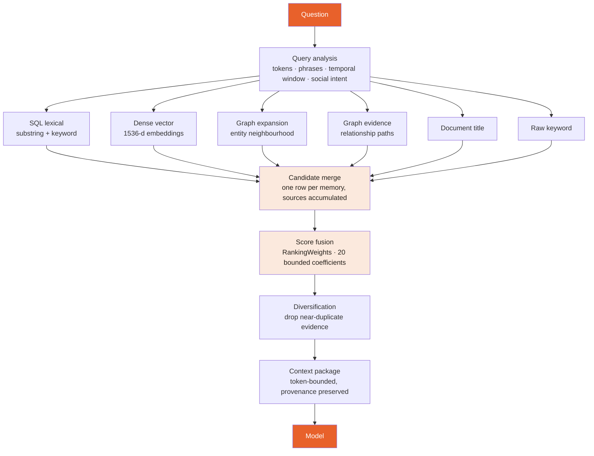
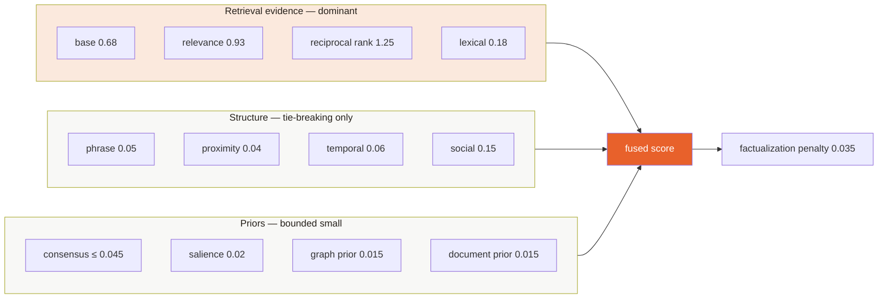
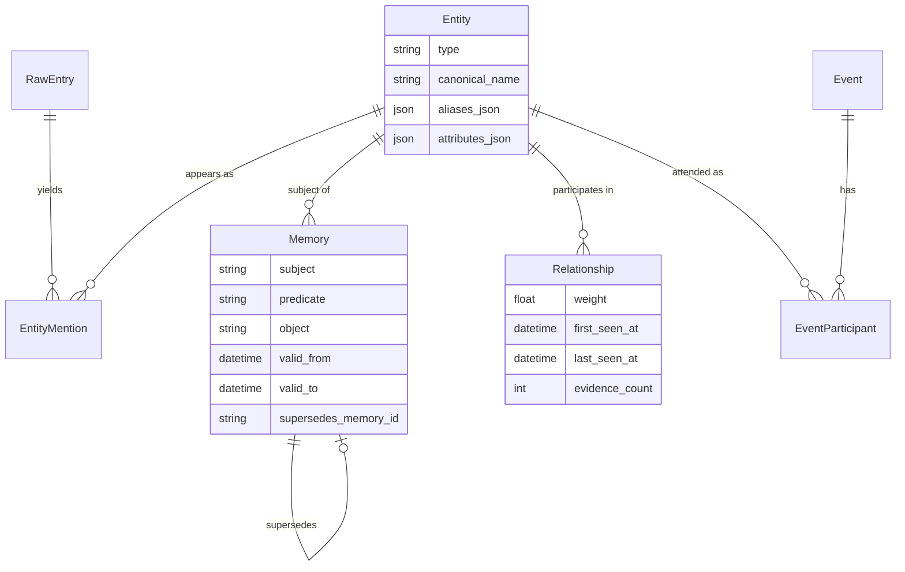

# How Recall Works

Thought Pins does not do RAG in the usual sense. There is no single vector index
that a question is matched against. A question runs through six independent
retrieval channels, and their disagreement is itself a signal in the ranking.

This document describes what the code actually does. Where a claim has been
measured, the measurement and its sample size are given; where it has not, that
is said plainly.

---

## The pipeline



Each channel is wrapped so that one failing — an unreachable vector service, a
graph query that times out — degrades recall instead of failing the request. A
question still answers when the vector store is down; it just answers from
lexical and graph evidence.

---

## Why six channels instead of one embedding index

Because they fail differently, and the failures are not correlated.

| Channel | Finds what the others miss | Its blind spot |
|---|---|---|
| Dense vector | Paraphrase — "felt low" for "was depressed" | Rare proper nouns it never saw in training |
| SQL lexical | Exact rare names, IDs, spellings | Any rewording at all |
| Graph expansion | Facts about a person you did not name | Needs the entity to be resolved first |
| Graph evidence | Multi-hop — "who introduced me to Maya" | Sparse early in a journal's life |
| Document title | Sources by what they are called | Nothing inside the document |
| Raw keyword | Text not yet extracted into memory | No semantic reach |

Embeddings alone reliably miss rare proper nouns; that is the single most
common failure in personal memory, because a journal is mostly proper nouns.

---

## Score fusion

Every coefficient the scorer multiplies by lives in one frozen dataclass,
`RankingWeights` in `src/thoughtpins/memory/ranking.py`, with a validated upper
bound on each. That is deliberate: a hyperparameter scattered as a literal
inside the scoring function is one an ablation cannot see.



The structure is the point: **retrieval evidence stays dominant.** Personal
importance and social structure are bounded so they can break a close tie but
cannot manufacture relevance that candidate generation never found. A ranker
whose priors can outvote its evidence is a ranker that confidently returns the
wrong memory.

### Consensus is saturating, not linear

```
consensus = min(consensus_cap, log1p(number_of_sources) × consensus_scale)
          = min(0.045,        log1p(n) × 0.018)
```

The second channel to independently find a candidate is strong evidence. The
fifth adds almost nothing. A linear bonus would let a bland result that every
channel weakly matches beat a precise result that one channel found decisively
— which is the classic hybrid-search failure.

---

## Reciprocal Rank Fusion

Channels return incomparable scores: BM25 is unbounded, cosine similarity is
[-1, 1], graph hops are integers. Normalising them against each other requires
assumptions none of them justify. RRF uses only the **rank** each channel
assigns, which is the one thing they all agree on the meaning of.

```
RRF(d) = Σ  1 / (k + rank_c(d))
        c∈C
```

Weighted at 1.25 — the largest coefficient in the model, because agreement on
ordering is the strongest available evidence.

---

## Temporal and social relevance

Two dedicated modules, because a personal journal asks questions that generic
retrieval has no notion of.

**Temporal** (`temporal_relevance.py`) — "last week", "before the move", "that
summer" parse into a window, and candidates are matched against it. Without
this, "what did I do last Tuesday" retrieves every Tuesday.

**Social** (`social_relevance.py`) — the query is analysed for social intent,
candidates are decomposed into facets, and evidence is scored against them.
"Who was at the harbour dinner" is an event-participant query, not a text-match
query.

---

## The memory model underneath

Retrieval reads a bitemporal entity–relationship store, not a document pile.



`Memory` carries `valid_to` and `supersedes_memory_id`, so a fact that stops
being true is superseded rather than overwritten. "Where does Maya work" can be
answered for today and for last year, and the change itself is visible. That is
what makes this a memory system rather than a search index.

---

## What has been measured

**LongMemEval**, n = 46, `memory/longmemeval_benchmark.py`:

| System | Recall@1 | Recall@10 |
|---|---|---|
| BM25 baseline | 0.847826 | — |
| Thought Pins | 0.869565 | 1.000 |

Read that honestly: the Recall@1 gap is **one question** at n = 46. It is not a
significant result and is not claimed as one. `Recall@10 = 1.000` says the
correct memory is always in the candidate pool — the ranking, not the retrieval,
is what remains to improve. Multi-session recall sits at 0.70 and is the weakest
measured area.

A 500-question run is outstanding, and is listed under
[What's unproven](../../README.md#whats-unproven) in the README rather than
quietly omitted.

**Query cost.** `tests/test_context_query_cost.py` grows one dimension at a time
and asserts the query count does not follow. Context assembly went from 622
queries to 133 through eager loading and batched entity lookup, with the output
hash unchanged (`85f85507c2f74513`) — proof it was a cost change and not a
behaviour change.

---

## Embeddings

Provider-agnostic by configuration (`EMBEDDING_PROVIDER` ∈ `llm | local |
openai`), 1536 dimensions by default. The vector index is treated as **derived
state**: SQL decides what a tenant may see, and vector hits are re-checked
against it before they are merged. A vector store that returns another tenant's
neighbour cannot leak, because the row it points at is authorised separately.

---

## Reading the code

| Module | Responsibility |
|---|---|
| `memory/search.py` | Candidate generation, channel isolation |
| `memory/ranking.py` | Pure score fusion — no I/O, replayable under ablation |
| `memory/temporal_relevance.py` | Date-window parsing and matching |
| `memory/social_relevance.py` | Social intent, facets, evidence scoring |
| `memory/context_sections.py` | Token-bounded context assembly |
| `memory/graph_store.py` | Entity/relationship traversal |
| `memory/evaluation_metrics.py` | Recall@k, MRR, nDCG |

Ranking is deliberately pure. An evaluation replays the same candidate pool
under controlled ablations without querying a provider again or changing
tenant-scoped retrieval — which is the only way to know whether a weight change
helped.
